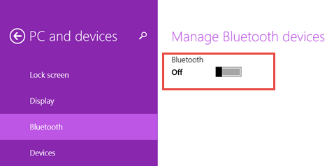
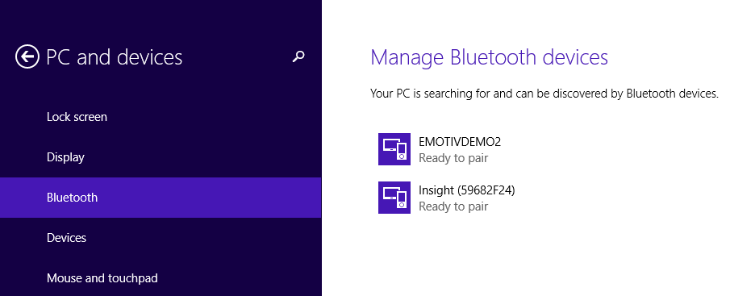
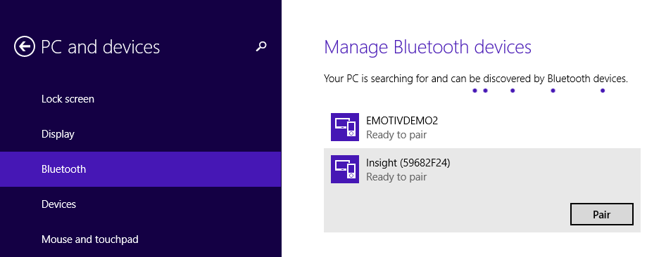
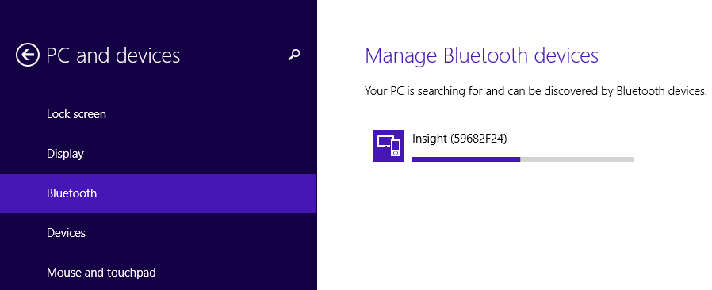
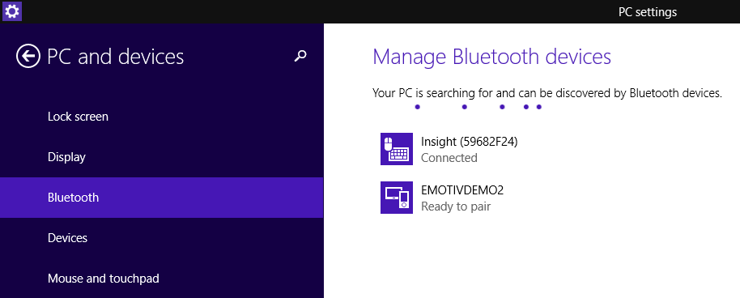

***Note***: With Windows 7, Vista, Windows XP you need to go to: [http://plugable.com/products/usb-bt4le](http://plugable.com/products/usb-bt4le) and choose Driver corresponding with OS to download and install.

To set up a Bluetooth enabled device, you need to do three things:


1. Add a Bluetooth adapter to your computer (if you use a desktop computer)
This is usually done by plugging the adapter into a USB port. (If a Bluetooth adapter is already built in or attached to your computer, ignore this step.)

2. Set up Epoc+ or Insight Emotiv headset so that your computer can find it. To do this, you must:
	- Turn on Epoc+ or Insight Emotiv headset.

3. Installthedevice. To install most devices, such as a mobile phone, keyboard, mouse, or personal digital assistant (PDA), you can use Bluetooth Devices in Control Panel. If you have Bluetooth wireless technology installed on your computer, follow these steps:

	a. Turn on Bluetooth on your Windows 8.1 device. Go to PC Settings and then to PC and devices. Select the Bluetooth section where you will see a switch for turning on the Bluetooth chip on your Windows 8.1 device.

	

	Set it to On and Windows 8.1 immediately starts looking for Bluetooth devices.

	b. Pair Bluetooth devices

	After a couple of seconds, Windows 8.1 displays your Bluetooth EPOC+ or Insight Emotiv headset. Depending on whether it has the drivers for it or not, you may see the full name of the device or just a generic name like Epoc+ or Insight. Beneath its name, Windows 8.1 says that the Insight is ready to pair.

	

	Select the newly discovered Insight and press Pair.

	

	The pairing process starts. If Windows 8.1 already has drivers for your Insight, it will install it in seconds. If it doesn't, then it will download them from the Internet and the process will take longer. Also, the name of the device will change until the process is completed.
	

	When done, Windows 8.1 displays the exact name of your Insight and says that it is connected, just beneath the name of the Insight.

	

	Now you can start using the Insight headset to navigate through the operating system. When you will need to disconnect the Insight headset from your Windows 8.1 laptop or tablet, simply turn off the Insight headset using its button on the back. When you turn it on again, Windows 8.1 should be able to detect it and pair it quickly. If it doesn't, you should go through the pairing process again, as shown above.
