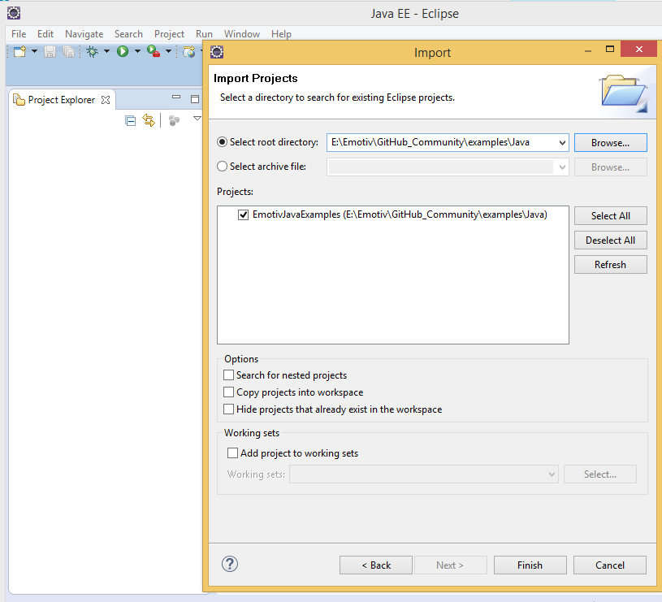
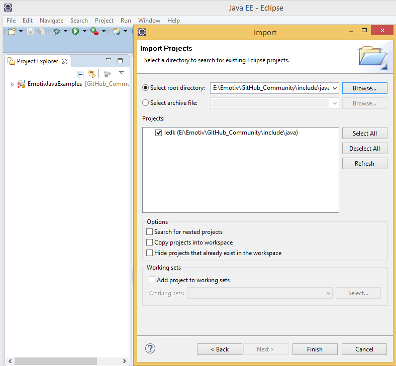
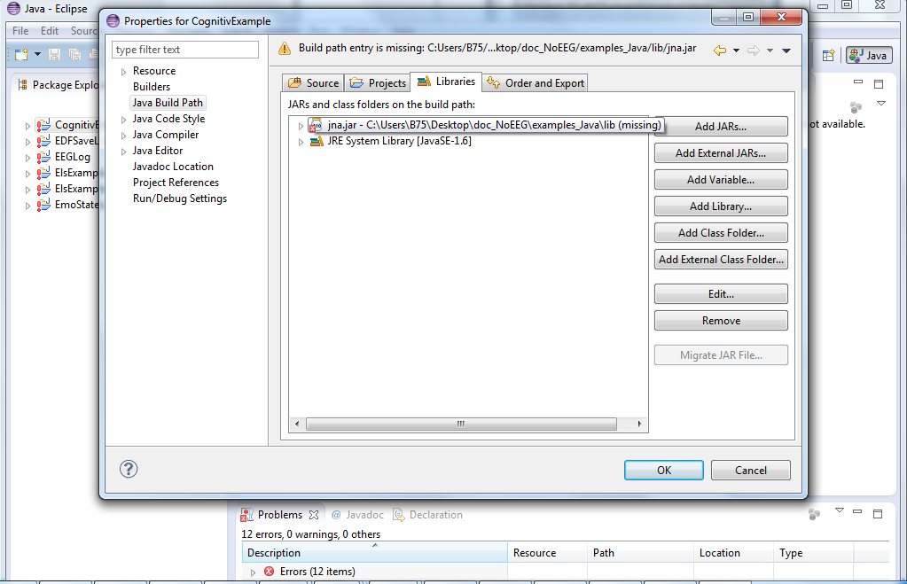
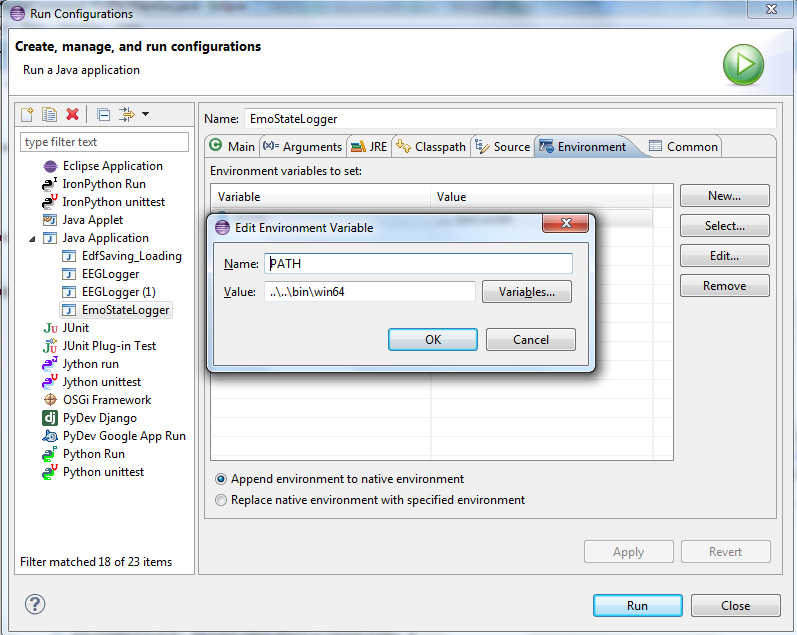

**1. Install jdk 32 or 64**

**2. Install & open `Eclipse`**

**3. Import existing project:**

- Open File menu/ Switch Workspace/ Other
- Select root directory, click Browse and go to directory store java examples
- Select All or one example for import

- Finish

**4. Import include/java**

- On `Package Explorer` panel, right click and choose Import.
- Choose General -> Existing Projects into Workspace / Next
- Select root directory, click Browse and go to directory store include/java for Import

- Finish

**5. Link to `jna.jar`:**

- Right click on project & choose Properties.
- Choose `Java Build Path` -> `Libraries` tab.
- Select `jna.jar` & `Remove`.
- Click on `Add External JARs` & select file `jna.jar` in folder lib.

***If you install jdk 64 bit you need set jre to folder store jre 64 bit and set PATH variable is win64***

***If you install jdk 32 bit you need set jre to folder store jre 32 bit and set PATH variable is win32***

To set jre do follow:

On Package Explorer, select JRE system library
Right mouse and select Properties, click to Installed JRE
You can edit path to jre 32 or 64 corresponding with jdk you install

**6. Add PATH**

- Select one example you want to run 
- Open Run menu/ Run Configurations 
- Choose Environment tab/ New

	You enter Name and Value variable as follow: (You can do same with 32 bit)
	
	
	
- OK

**7. Click Run for running example**