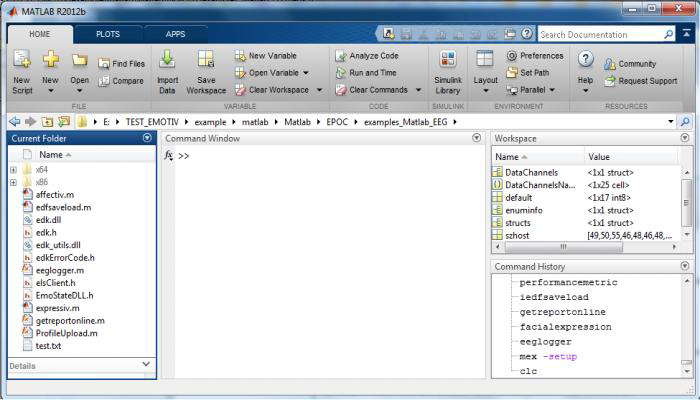
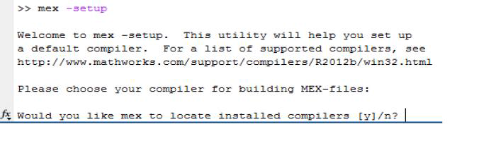
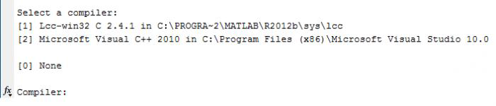
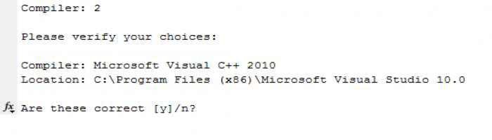
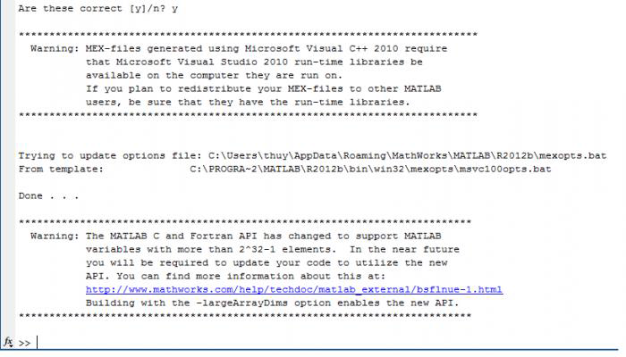

**1. Test Examples**


Open matlab, select Home / Open. You go to folder store example matlab

- Step 1: mex-setup

Matlab show:

- Step 2: Choice: y

Matlab Show:

- Step 3: Choice 2

- Step 4: Choice y 

Matlab Show:

- After building, you select a file.m, click F9 to run

**2. Note**

- If you run example and get a error same as:

`>> getreportonline`

`EDK library already loaded`

`Error using calllib`

`Parameter can not be converted to a string`

`Error in getreportonline (line 34)`

`AllOK = calllib('edk','EE_EngineConnect', default); % success means this value
is 0`

You click to line 34 and change default by 'Emotiv Systems-5', you save code
and click F9 again to run.

- You need run ProfileUpload example first.