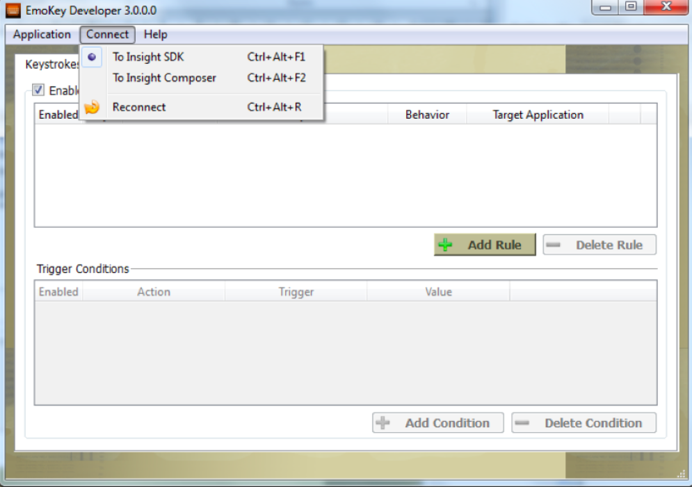
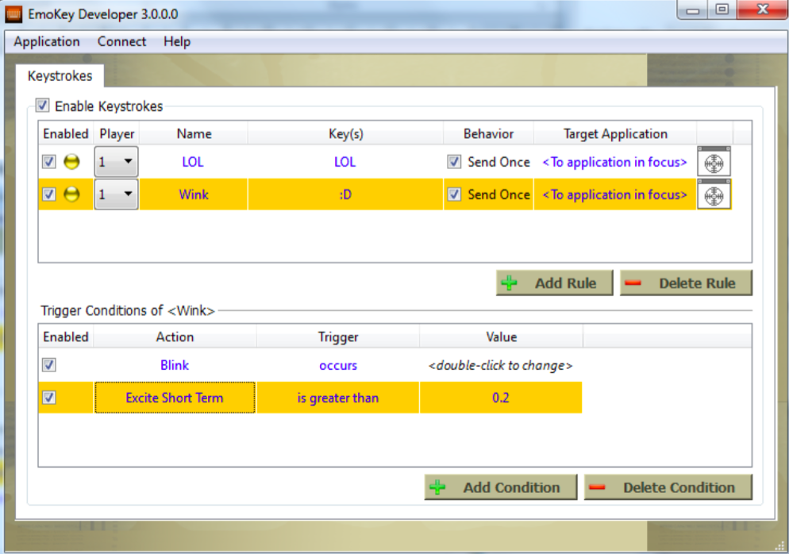
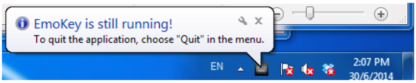
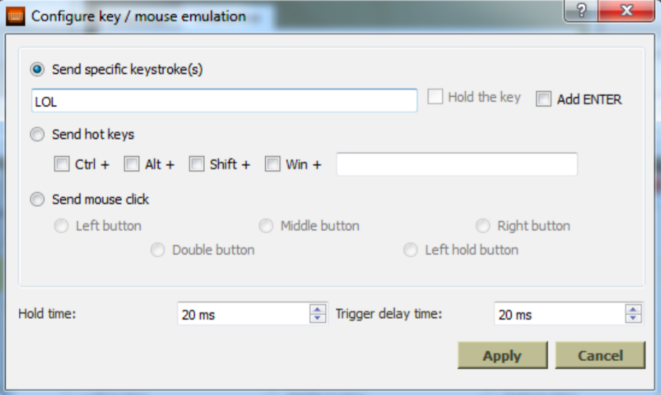
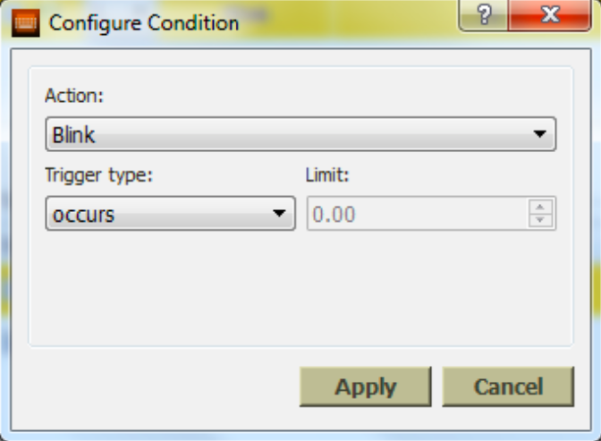
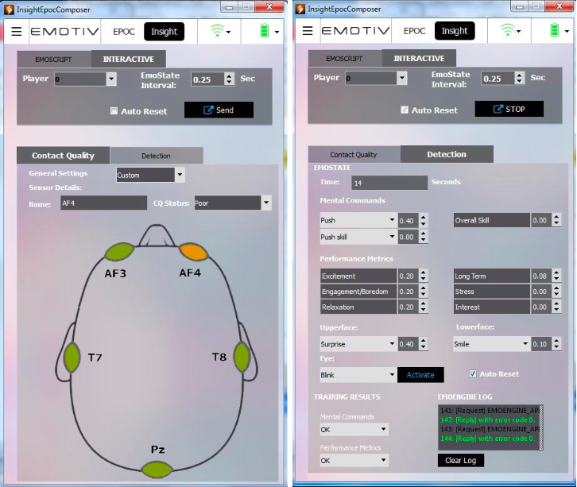
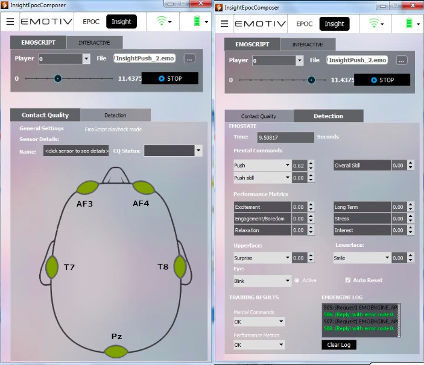

### TABLE OF CONTENTS

#### [Emotiv Xavier Tools](#0)

#### [1. Introduction to XavierEmoKey](#1)

#### [1.1 Connecting XavierEmoKey to Emotiv EmoEngine](#1.1)

#### [1.2 Configuring XavierEmoKey Rules](#1.2)

#### [1.3 XavierEmoKey Keyboard Emulation](#1.3)

#### [1.4 Configuring XavierEmoKey Rule Trigger Conditions](#1.4)

#### [1.5 Saving Rules to an XavierEmoKey Mapping file](#1.5)

#### [2. Xavier Composer usage](#2)

#### [2.1 INTERACTIVE mode](#2.1)

#### [2.2 EmoScript Mode](#2.2)

###  Emotiv Xavier Tools

This section explains the software utilities provided with the Emotiv Xavier: XavierEmoKey and XavierComposer.
XavierEmoKey allows you to connect detection results received from the EmoEngine to predefined keystrokes according to easy-to-define, logical rules. This functionality may be used to experiment with the headset as an input controller during application development. It also provides a mechanism for integrating the Emotiv neuroheadset with a preexisting application via the application’s legacy keyboard interface.

XavierComposer emulates the behavior of the EmoEngine with an attached Emotiv neuroheadset. It is intended to be used as a development and testing tool; it makes it easy to send simulated EmoEngine events and request responses to applications using the Emotiv API in a transparent and deterministic way.

####  1. Introduction to XavierEmoKey
XavierEmoKey translates Emotiv detection results to predefined sequences of keystrokes according to logical rules defined by the user through the XavierEmoKey user interface. A set of rules, known as an “EmoKey Mapping”, can be saved for later reuse. XavierEmoKey communicates with Emotiv EmoEngine in the same manner as would a third-party application: by using the Emotiv API exposed by InsightEDK.dll.

#####  1.1 Connecting XavierEmoKey to Emotiv EmoEngine
By default, XavierEmoKey will attempt to connect to Emotiv Xavier when the application launches. If Emotiv Xavier isn’t running, then XavierEmoKey will display a warning message above the system tray. The reason XavierEmoKey connects to the Insight SDK, instead of connecting directly to the EmoEngine and the neuroheadset, is to allow the user to select his profile, configure the detection suite settings, and get contact quality feedback through the Insight SDK user interface. Please see Section **Error! Reference source not found**. for more details about when Emotiv SDK developers might wish to follow a similar strategy.

XavierEmoKey can also be connected to XavierComposer . This is useful when creating and testing a new EmoKey Mapping since the user can easily generate EmoState update events that satisfy the conditions for rules defined in XavierEmoKey. Refer to Section 1.2 for more information about XavierComposer.

**Figure 1 XavierEmoKey Connect Menu**

XavierEmoKey’s connection settings can be changed by using the application’s ***Connect*** menu. If XavierEmoKey is not able to connect to the target application (usually because the connection target is not running), then the XavierEmoKey icon in the system tray will be drawn as gray, instead of orange). If this occurs, then run the desired application (either Xavier Driver or Xavier Composer ) and then select ***Reconnect*** from the ***Connect*** menu.

#####  1.2 Configuring XavierEmoKey Rules

**Figure 2 Example XavierEmoKey Mapping**

Figure above shows an example of an EmoKey Mapping as it might be configured to communicate with an Instant Messenger (IM) application. In this example, XavierEmoKey will translate Blink events generated by Emotiv’s Expressiv to the text “LOL” (as long as the AffectivTM’s Instantaneous Excitement detection is also reporting a score > 0.3), which causes the IM program to send “LOL” automatically when the user is blink.

The topmost table in XavierEmoKey contains user interface controls that allow you to define rules that specify which keystrokes are emulated. Rules can be added by clicking on the ***Add Rule*** button. Existing rules can be deleted by selecting the appropriate row and pressing the ***Delete Rule*** button. In Figure 2, two rules, named “LOL” and “Wink”, were added. Rules can be edited as outlined below, in Table 1.

Field	| Description | Notes
------------- | ------------- | -------------
***Enabled***  | Checkbox to selectively enable or disable individual rules | The indicator “light” will turn green when the rule conditions are satisfied.
***Player***  | Identifies the neuroheadset that is associated with this rule | Player 1 corresponds to user ID 0 in Xavier Composer and Xavier SDK.
***Name***  | User-friendly rule name | Edit by double clicking on the cell.
***Key***  | Keystroke sequence to be sent to the Windows input queue | Edit by double clicking on the cell.
***Behavior***  | Checkbox to control whether the key sequence is sent only once, or repeatedly, each time an EmoState update satisfies the rule conditions | If checked, then XavierEmoKey must receive an EmoState update that does NOT satisfy the rule’s conditions before this rule can be triggered again.

***Table 1 XavierEmoKey Rule Definition Fields***

#####  1.3 XavierEmoKey Keyboard Emulation

XavierEmoKey emulates a Windows-compatible keyboard and sends keyboard input to the Windows operating system’s input queue. The application with the input focus will receive the emulated keystrokes. In practice, this often means that XavierEmoKey is run in the background. Please note that closing the XavierEmoKey window will only hide the application window and that it will continue to run. When running, the XavierEmoKey/Emotiv icon will be visible in the Windows system tray. Double-click on this icon to bring XavierEmoKey back to the foreground. Choose **Quit** from the **Application** or **system-tray menu** to really quit the application.

***Figure 3 XavierEmoKey System Tray Icon***

Double-clicking in the Key field of a rule will bring up the Keys dialog as shown in

***Figure 4 Defining Keys and Keystroke Behavior***

The Keys dialog allows the user to specify the desired keystrokes and customize the keystroke behavior. The customizable options include:

- Holding a key press: hold the key down for the duration of the rule activation period.
The Hold the key checkbox is only enabled when a single key has been specified in
the keystroke edit box.

- Hot keys or special keyboard keys: any combination of control, alt, shift, the Windows
key, and another keystroke. You may also use this option if you need to specify
special keys such as Caps Lock, Shift, or Enter.

- Key press duration and delay times: some applications, especially games, are
sensitive to the timing of key presses. If necessary, use these controls to adjust the simulated keyboard behavior.

#####  1.4 Configuring XavierEmoKey Rule Trigger Conditions

The ***Trigger Conditions*** table in XavierEmoKey contains user interface controls that allow you to define logical conditions that determine when the corresponding rule is activated. Clicking on a new rule in the Rules table will refresh the contents of the ***Trigger Conditions*** table, causing it to display only the conditions associated with the selected rule.

Conditions can be added by clicking on the ***Add Condition*** button. Existing rules can be deleted by selecting the appropriate condition and pressing the ***Delete Condition*** button. In Figure 2, two conditions, which examine the state of the Expressiv Laugh detection and the AffectivTMInstantaneous Excitement detection, respectively, are associated with the LOL rule. All enabled conditions must be satisfied by the most recent EmoState update received from Emotiv Xavier or Xavier Composer for a rule to be triggered.

The fields of the ***Trigger Conditions*** table are described below, in Table 2.

Field   | Description
------- | -----------
**Enabled** | Checkbox to selectively enable or disable individual trigger conditions
**Action**  | The name of the Expressiv expression, AffectivTMdetection, or Cognitiv action being examined by this condition.
**Trigger** | Description of the trigger condition being evaluated
**Value** |For non-binary trigger conditions, the value being compared to the action score returned by the designated detection

**Table 2 XavierEmoKey Trigger Condition Fields**

Double-clicking on any of the fields of a condition in the ***Trigger Conditions*** table will reveal the ***Configure Condition*** dialog box, as shown in Figure 5. Use the controls on this dialog to specify an action (or detection) name, a comparison function, and a value, that must evaluate to true for this condition to be satisfied.

***Figure 5 Defining an XavierEmoKey Condition***

#####  1.5 Saving Rules to an XavierEmoKey Mapping file

XavierEmoKey allows you to save the current set of rule definitions to an XavierEmoKey Mapping file that can be reloaded for subsequent use. Use the appropriate command in XavierEmoKey’s Application menu to rename, save, and load EmoKey mapping files.

####  2. Xavier Composer usage

Xavier Composer allows you to send user-defined EmoStatesTM to Emotiv Xavier, XavierEmoKey, or any other application that makes use of the Emotiv API. Xavier Composer supports two modes of EmoState generation: Interactive mode and EmoScript mode. In addition to generating EmoStates, Xavier Composer can also simulate Emotiv EmoEngine’s handling of profile management and training requests.

SDK users will rely on Xavier Composer to simulate the behavior of Emotiv EmoEngine and Emotiv neuroheadsets. However, it is a very useful tool for all Emotiv SDK developers, allowing for easy experimentation with the Emotiv API early in the development process, and facilitating manual and automated testing later in the development cycle.

#####  2.1 INTERACTIVE mode

**Figure 6 Xavier Composer interactive mode**

Xavier Composer Interactive mode allows you to define and send specific EmoState values to any application using the Emotiv SDK. The user interface settings are described below.

- Player: choose the player number who’s EmoState you wish to define and send. The player number defaults to 0. When the player number is changed for the first time, an application connected to XavierComposer will receive an EE_UserAdded event with the new player number reported as the user ID.

- Wireless: sets the simulated wireless signal strength. Note: if the signal strength is set to “Bad” or “No Signal” then XavierComposer TM simulates the behavior of the EmoEngine by setting subsequent EmoState detection values and signal quality values to 0.

- Contact Quality tab: this tab allows you to adjust the reported contact quality for each sensor on the Emotiv neuroheadset. When the Contact Quality tab is active, all other EmoState detection values are set to 0. You can choose between typical sensor signal quality readings by selecting a preset from the General Settings drop- down list box. If you choose the Custom preset, each sensor value can be controlled individually by clicking on a sensor and then selecting a new CQ Status value in the Sensor Details box. Note that the two sensors above and behind the ears, correspond to the reference sensors on the Emotiv SDK Neuroheadset, must always report a CQ value of Good and cannot be adjusted.

- Detection tab: this tab allows you to interactively control EmoStateTM detection values and training result values. When the Detection tab is active, the contact quality values for generated EmoStates will always be set to EEG_CQ_GOOD.

- EMOSTATE: define the detection settings in an EmoStateTM by selecting the particular event type for each detection group in the appropriate drop-down list box. Set the event’s value in the spin box adjacent to the event name. You can define your own time value in the Time edit box, or allow XavierComposer TM to set the value automatically by incrementing it by the value of the EmoState Interval spin box after each EmoStateTM is sent. The AffectivTMExcitement state is unique in that the EmoEngine returns both short-term (for Instantaneous Excitement) and long-term values. XavierComposer TM simulates the long-term value calculation adequately enough for testing purposes but does not reproduce the exact algorithm used by the AffectivTMdetection suite in EmoEngineTM. Note that the value for the eye detections is binary (Active or Inactive) and that it is automatically reset to be Inactive after an EmoStateTM is sent. If Auto Repeat mode is active, then you can press and hold the Activate button to maintain a particular eye state across multiple time intervals. Also note that the value for a neutral Cognitiv detection is automatically set to 0.

- TRAINING RESULTS: specify the desired return value for EmoEngineTM requests generated for the current player by the EE_CognitivSetTrainingControl and IEE_FacialExpressivSetTrainingControl functions.

- EMOENGINE LOG: contents are intended to give developers a clearer picture about how the EmoEngine processes requests generated by various Emotiv API functions. The log displays three different output types: Request, Reply, CogResult, and ExpResult. An API function call that results in a new request to the EmoEngine will cause a Request output line to be displayed in the log. The multitude of API functions are translated to roughly a dozen different strings intended to allow the Emotiv SDK developer to see that an API function call has been serviced . These strings include: PROFILE_ADD_USER, PROFILE_CHANGE_USER, PROFILE_REMOVE_USER, PROFILE_LIST_USER, PROFILE_GET_CURRENT_USER, PROFILE_LOAD, PROFILE_SAVE, FACIALEXPRESSIV_GET, FACIALEXPRESSIV_SET, PERFORMANCEMETRIC_GET, PERFORMANCEMETRIC_SET, COGNITIV_SET and COGNITIV_GET. Because of the comparatively complex API protocol used to facilitate training the Cognitiv algorithms, we display additional detail when we receive training control messages generated by the EE_CognitivSetTrainingControl API function. These strings are: COGNITIV_START, COGNITIV_ACCEPT, and COGNITIV_REJECT, which correspond to the EE_TrainingControl_t constants exposed to developers in edk.h. Similar strings are used for the equivalent Expressiv messages. All other request types are displayed as API_REQUEST. The Reply output line displays the error code and is either green or red, depending on whether an error has occurred (i.e. the error code != 0). The CogResult and ExpResult outputs are used to inform the developer of an asynchronous response sent from the EmoEngine via an EmoState update as the result of an active Cognitiv or Expressiv training request.

- START: sends the EmoStateTM to a connected application or the Emotiv Xavier. Note that Insight SDK will display “Cannot Acquire Data” until the first EmoStateTM is received from XavierComposer .

- Auto Reset: check this box to tell XavierComposer TM to automatically send EmoStatesTM at the time interval specified in the EmoStateTM Interval spin box. Use the Start/Stop button to turn the automated send on and off. You may interact with the EmoStateTM controls to dynamically change the EmoStateTM values while the automated send is active. Note: switching between the Contact Quality and Detection tabs in Interactive mode will automatically stop an automated send.

####  2.2 EmoScript Mode

**Figure 7 XavierComposer EmoScript Mode**

XavierComposer TM EmoScript mode allows you to playback a predefined sequence of EmoStateTM values to any application using the EmoEngine. The user interface settings are described below. EmoScript files are written in EML (XavierComposer TM Markup Language). EML syntax details can be found in the EML Language Specification section in **Error! Reference source not found**. this document.

- Player: choose the player number to associate with the generated EmoStatesTM.

- File: click the “...” button to select and load an EmoScript file from disk. If the file loads successfully then the timeline slider bar and Start button will be activated. If an error occurs, a message box will appear with a description and approximate location
in the file.

- Timeline Slider: move the slider control to see the EmoStateTM and signal quality values for any point on the timeline defined by the EmoScript file.

- Start/Stop button: starts and stops the playback of the EmoStateTM values generated by the EmoScript file.

- Wireless: the wireless signal strength setting is disabled while in EmoScript mode and the wireless signal strength is always set to “Good.”

- Contact Quality tab: the indicators on the head model correspond to the values defined by the contact_quality tag at specific time code in the EmoScript file. If no contact_quality tag has been specified then the contact quality values in the generated EmoStates default to CQ_GOOD.

- Detection tab: this tab allows you to view EmoState detection values and provides interactive control over training result values. Unlike Real Time Interactive mode, the signal quality and detection values are determined entirely by the contents of the EmoScript file and you can switch between the Signal Quality tab and the Detection tab to view the appropriate data during playback or timeline navigation.

- EmoState: the values displayed correspond to the EmoStateTM values for a particular point in time as defined by the EmoScript file. Note that these EmoScript values are not interactive and cannot be modified by the user (use the Interactive mode for this instead).

- Training Results and EmoEngine Log: these controls operate exactly the same as they do in Interactive Mode. See the Interactive Mode documentation (above) for more details.
